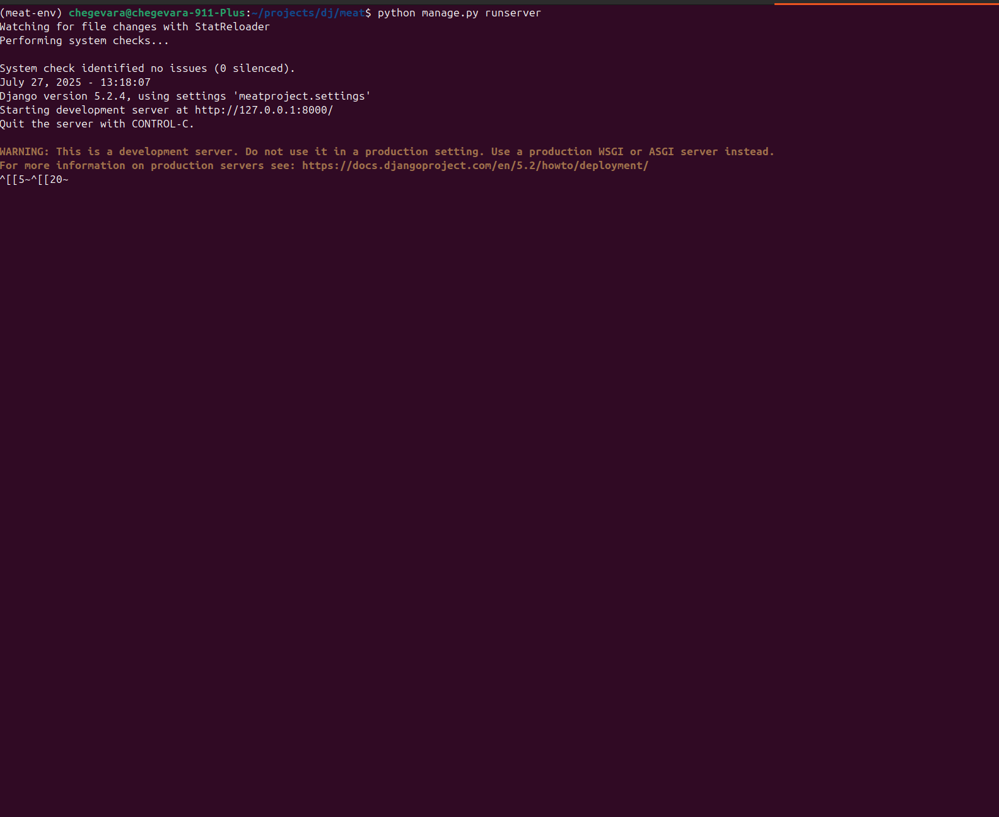
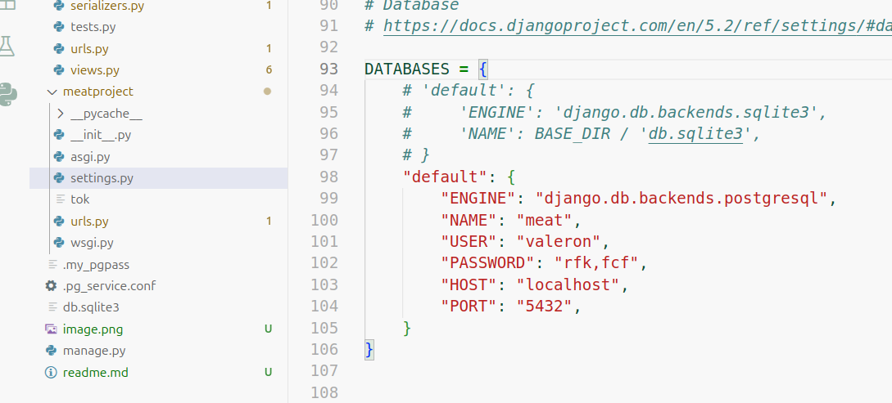
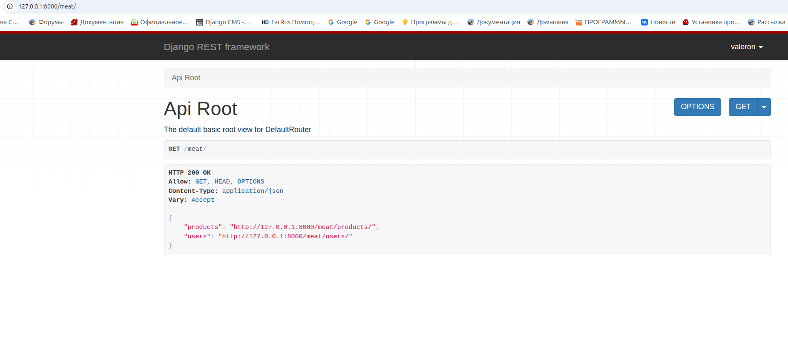

Проект разрабатывался в linux. Поэтому настройка проекта актуально только для ос Linux.
Проект разрабатывался через следующие технологии:
python3m djangorestframework, django, postgresql

1. Создание виртуального окружения:
python3 -m venv meat-env
где meat-env директория в которой будет установлен интерпретатор python,
директорию можно указать любую. На ваше усмотрение.

2. Активация виртуального окружения
source meat-env/bin/activate

3. Для корректного запуска проекта необходимо установить паекты следующие пакеты через pip:
asgiref                  3.9.1
Django                   5.2.4
django-debug-toolbar     5.2.0
django-filter            25.1
django-phone-field       1.8.1
django-phonenumber-field 8.1.0
djangorestframework      3.16.0
Markdown                 3.8.2
phonenumbers             9.0.10
phonenumberslite         9.0.10
pip                      24.0
psycopg2-binary          2.9.10
sqlparse                 0.5.3

, установка осуществляется через pip
Пример:
python -m pip install Django
    pip install psycopg2
    pip install psycopg2-binary
    pip install "django-phonenumber-field[phonenumberslite]"
    pip install "django-phonenumber-field[phonenumbers]"
    pip install django-phone-field
    pip install djangorestframework
    pip install markdown
    pip install django-filter

4. Необходимо создать базу данных. 
Для создания базы данныхх использовал терминал linux
Вы можете использовать любой инструмент

5. Для кооректной работы необходимо настроить подключение к базе в файле проекта settings.py

6. Необходимо создать миграции запустив из корня проекта комманду:
python manage.py makemigrations meat

7. После создания миграций, их нужно выполнить, запустив из корня проекта комманду:
python manage.py migrate

8. После установки пакеты необходимо запустить сервер:
python manage.py runserver

9. Открываем в браузере страницу:
http://127.0.0.1:8000/meat

10. Описание моделей храниться в файле models.py

11. Для регистрации нового пользовователя используем следующий url:
    http://127.0.0.1:8000/meat/register

    body:
        {
            "username":"admin",
            "email":"admin@gmail.com",
            "password":"12345@34",
            "phone":"89612345671",
            "address":"bomj"
        }
, после успешной регистрации вернёться response status 200:
{
    "token": "f734de1303721ae5404a70fd77b158530de5797e",
    "user": {
        "username": "admin2",
        "phone": "89612345675",
        "address": "bomj"
    }
}

12. Для авторизации авторизация http://127.0.0.1:8000/meat/login
С телом запроса 
{
    "phone":"89612345678"
}
В случае успеха response:
{
    "token": "ef6694f1de6cd6b8f8116d5da6d20f60feda6fd8",
    "user": {
        "username": "valeron2",
        "phone": "89612345678",
        "address": "bomj"
    }
}

13. Получение токена используя basic authentification:
http://127.0.0.1:8000/api-token-auth/
, тело запроса
{
    "username":"admin",
    "password":"12345@34"
}

14. получить список всех товаров http://127.0.0.1:8000/meat/products/.
Обязательно использовать токен для авторизации, добавив в заголоцки
key: Authorization, value:token 9b6602fcb0e0621d4e98fa30b62241c22c598587

response:
[
    {
        "id": 1,
        "title": "test",
        "description": "test",
        "price": "10.45",
        "availability": false,
        "category": "http://127.0.0.1:8000/meat/category/1"
    },
    {
        "id": 2,
        "title": "test1",
        "description": "test1",
        "price": "1000.00",
        "availability": true,
        "category": "http://127.0.0.1:8000/meat/category/1"
    },
    {
        "id": 3,
        "title": "test2",
        "description": "test2",
        "price": "1000.00",
        "availability": true,
        "category": "http://127.0.0.1:8000/meat/category/2"
    },
    {
        "id": 4,
        "title": "test3",
        "description": "test3",
        "price": "1000.00",
        "availability": true,
        "category": "http://127.0.0.1:8000/meat/category/2"
    },
    {
        "id": 5,
        "title": "test4",
        "description": "test4",
        "price": "1000.00",
        "availability": true,
        "category": "http://127.0.0.1:8000/meat/category/3"
    },
    {
        "id": 6,
        "title": "test4",
        "description": "test4",
        "price": "1000.00",
        "availability": true,
        "category": "http://127.0.0.1:8000/meat/category/3"
    },
    {
        "id": 7,
        "title": "test",
        "description": "test",
        "price": "10.55",
        "availability": false,
        "category": "http://127.0.0.1:8000/meat/category/1"
    },
    {
        "id": 8,
        "title": "test12",
        "description": "test12",
        "price": "100.00",
        "availability": true,
        "category": "http://127.0.0.1:8000/meat/category/1"
    },
    {
        "id": 9,
        "title": "test12",
        "description": "test12",
        "price": "100.00",
        "availability": true,
        "category": "http://127.0.0.1:8000/meat/category/1"
    },
    {
        "id": 10,
        "title": "test12",
        "description": "test12",
        "price": "100.00",
        "availability": true,
        "category": "http://127.0.0.1:8000/meat/category/1"
    },
    {
        "id": 11,
        "title": "t",
        "description": "t",
        "price": "10.00",
        "availability": true,
        "category": "http://127.0.0.1:8000/meat/category/1"
    },
    {
        "id": 12,
        "title": "testqa",
        "description": "testaaa",
        "price": "10.00",
        "availability": true,
        "category": "http://127.0.0.1:8000/meat/category/1"
    },
    {
        "id": 13,
        "title": "t2333",
        "description": "t2222",
        "price": "10.00",
        "availability": true,
        "category": "http://127.0.0.1:8000/meat/category/1"
    },
    {
        "id": 14,
        "title": "t2333w4",
        "description": "t2222dw",
        "price": "10.00",
        "availability": true,
        "category": "http://127.0.0.1:8000/meat/category/1"
    },
    {
        "id": 15,
        "title": "meat",
        "description": "t2222dw",
        "price": "10.00",
        "availability": true,
        "category": "http://127.0.0.1:8000/meat/category/1"
    },
    {
        "id": 16,
        "title": "meat1",
        "description": "testaaa",
        "price": "10.00",
        "availability": true,
        "category": "http://127.0.0.1:8000/meat/category/1"
    },
    {
        "id": 17,
        "title": "meat2",
        "description": "t2222dw",
        "price": "100.00",
        "availability": true,
        "category": "http://127.0.0.1:8000/meat/category/1"
    },
    {
        "id": 18,
        "title": "meat4",
        "description": "testaaa",
        "price": "10.00",
        "availability": true,
        "category": "http://127.0.0.1:8000/meat/category/1"
    }
]

15. Получение списка заказов пользователя http://127.0.0.1:8000/meat/orders?user=1
user является параметром не обязательным, если его убрать получим все заказы

16. 

